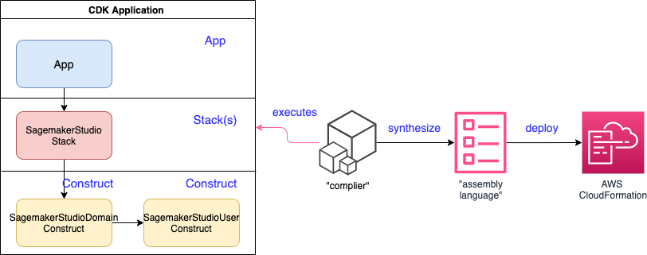
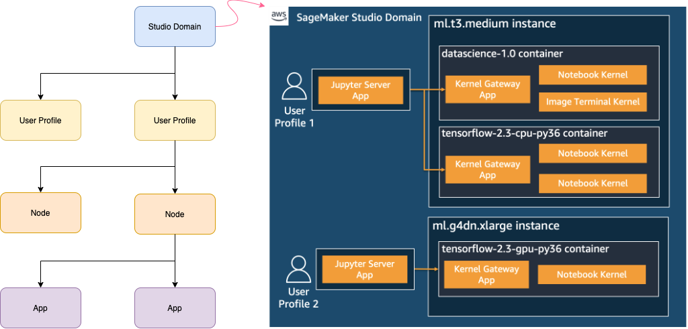

# Build and automatize the management of your Sagemaker Studio Users using AWS CDK!

이 프로젝트의 내용을 살펴보도록 해보겠습니다. 인스턴스가 있는 CDK 앱을 Stack을 통해 구성해봅니다.
스택 (`sagemakerStudioCDK`)

The `cdk.json` file tells the CDK Toolkit how to execute your app.

## Deployment Steps

Pre-requisites:

* An AWS profile with permissions to create AWS Identity and Access Management (AWS IAM) roles, Studio domains, and Studio user profiles
* AWS CLI, authenticated and configured
* Python 3.6+
* AWS CDK
* Git
* Cloud9
* Knowledge on how Amazon Sagemaker Studio works.

## Knowledge on how Amazon Sagemaker Studio works

Domain

도메인은 노트북 리소스의 루트 수준을 나타냅니다. 일반적으로 비슷한 책임을 공유하거나 비슷한 요구 사항을 가진 고객(예: 팀, 조직 또는 회사)이 동일한 도메인에서 동일한 리소스(데이터베이스, S3 버킷 등)에 액세스하는 경우가 많습니다. 
도메인에 연결된 일부 물리적 리소스는 EFS(노트북 저장소), S3(노트북 공유 매니페스트), SSO 디렉터리(SSO가 활성화된 경우), KMS 등입니다.

UserProfile

사용자 프로필이 최종 사용자에게 매핑됩니다. 하나의 도메인에는 여러 사용자 프로필이 연결되어 있을 수 있습니다. 
사용자 프로필은 최종 사용자가 액세스할 수 있는 리소스 종류를 결정하는 실행 역할에 바인딩됩니다.

Node

노드는 물리적 컴퓨팅 리소스를 나타냅니다. 사용자 프로필은 여러 노드를 보유할 수 있습니다. 
동일한 사용자 프로필 아래에 있는 노드는 동일한 보안 그룹에 바인딩되므로 노드 간 네트워크 연결이 가능합니다(아직 배포되지 않았지만 곧 제공될 예정).

App

앱은 Jupyter 서버, 커널 또는 TensorBoard 애플리케이션일 수 있습니다. 동일한 노드에서 여러 앱을 실행할 수 있습니다.

## Updated AWS Cloud9

* Sign in to the [AWS Management Console](https://console.aws.amazon.com/)
* Go to [Cloud9](https://console.aws.amazon.com/cloud9/) environment. and Click Open IDE

AWS Cloud9 사용자는 Node(v10.24.1)의 EOS메시지를 원하지 않은경우, 아래 Node와 AWS CDK 업데이트를 참고하십시오.  
기본설치된 node를 특정버전으로 설치할 경우(예, v14.5.0로 설치시)  

* 예) v14.5.0 설치시 -> nvm install 14.5.0

Node를 최신버전으로 설치합니다.

`nvm install node`

AWS Cloud9 사용자는 aws-cdk 최신버전으로 설치합니다. 
CDK버전은 최신버전 설치를 추천드립니다.(강제옵션이 필요한 경우 option --force)  

* 예) npm install -g aws-cdk --force

`npm install -g aws-cdk`

업데이트된 Node와 CDK 버전이 제대로 나오는지 확인합니다.

`node -v`  
`cdk --version`

## Lab Steps

Step 1: 다음 명령줄을 사용하여 로컬 디렉토리에 대한 Git 리포지토리를 확인하십시오.

`git clone https://github.com/comeddy/aws-cdk-sagemaker-studio`

Step 2: 디렉터리를 이전 단계에서 만든 새 디렉터리로 변경합니다.

`cd aws-cdk-sagemaker-studio/`

Step 3: 가상 환경 만들기:

`macOS/Linux: python3 -m venv .cdk-venv`  
`Windows: python -m venv .cdk-venv`

Step 4: 초기화 프로세스가 완료된 후 가상 환경을 활성화하면 가상 환경이 생성됩니다.

`macOS/Linux: source .cdk-venv/bin/activate`  
`Windows: .cdk-venv\Scripts\activate.bat`

Step 5: 필요한 종속성을 설치합니다:

`pip3 install -r requirements.txt`

Step 6: AWS CDK가 배포수행하는데 필요한 자원(asset)을 프로비저닝하도록 브트스트랩 스택을 설치합니다.

`cdk bootstrap`

Step 7: 템플릿을 합성합니다. AWS CDK 앱은 코드를 사용하여 인프라를 정의하고 실행 시 생성하거나
애플리케이션에 정의된 각 스택에 대한 AWS CloudFormation 템플릿을 "합성"합니다.

`cdk synthesize`

Step 8: 솔루션을 배포합니다.

`cdk deploy`

AWS CDK가 AWS 계정에서 생성하는 리소스를 검토하고 예를 선택하여 스택을 배포합니다.

AWS CloudFormation 콘솔에서 상태를 확인하여 스택이 배포될 때까지 기다립니다.

Enjoy!

## Useful commands

* `cdk ls`          list all stacks in the app
* `cdk synth`       emits the synthesized CloudFormation template
* `cdk deploy`      deploy this stack to your default AWS account/region
* `cdk diff`        compare deployed stack with current state
* `cdk docs`        open CDK documentation

## Cleanup

이 게시물에 배포된 리소스를 제거하려면 이 단계를 따르세요.

`cdk destroy`

4개의 스택 삭제를 확인하는 메시지가 표시되면 다음을 선택합니다. “`y`”.

## Security

See [CONTRIBUTING](CONTRIBUTING.md#security-issue-notifications) for more information.

## License

This library is licensed under the MIT-0 License. See the LICENSE file.

This code has been tested and verified to run with AWS CDK 1.120.0 (build 6c15150)

